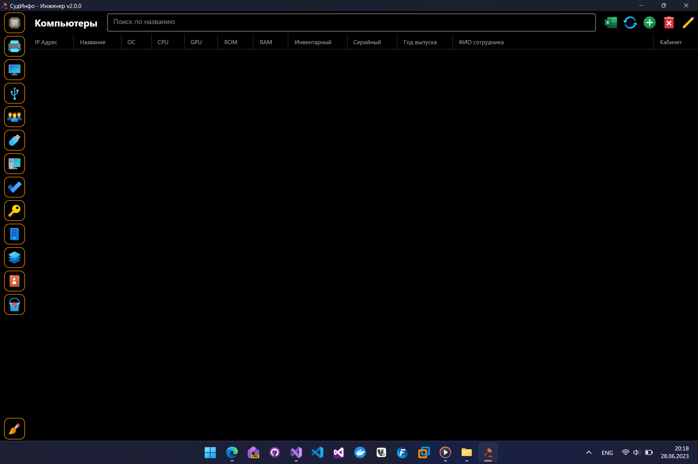
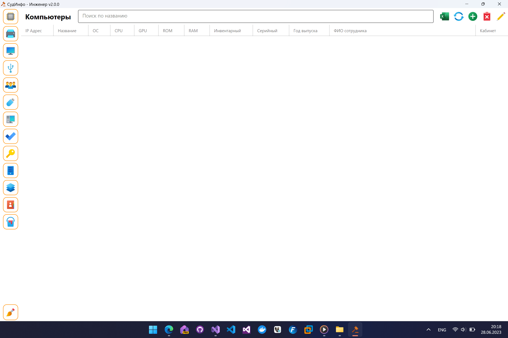
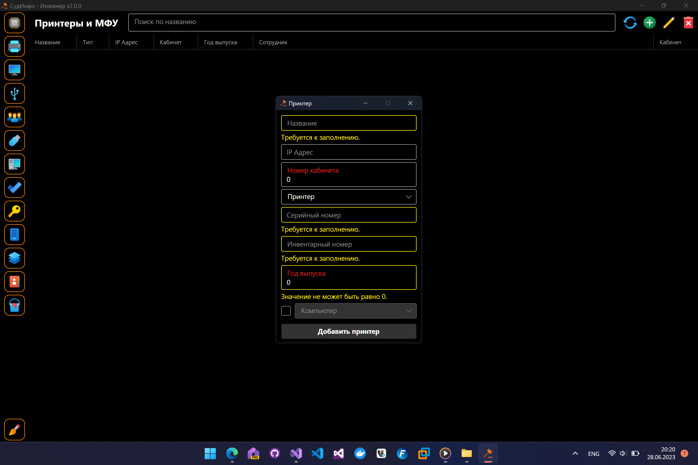

# СудИнфо-Инженер 
Это мой дипломный проект, цель которого упростить работу системного администратора организации и собрать всю информацию в одном месте.
***
## Стек технологий:
* Avalonia
* .NET 8, C#
* EF Core
* SqlLite
***
## Поддерживаемые платформы
* Windows 7/8/10/11
* Linux
* Mac OS
***
## Скриншоты

***

***

